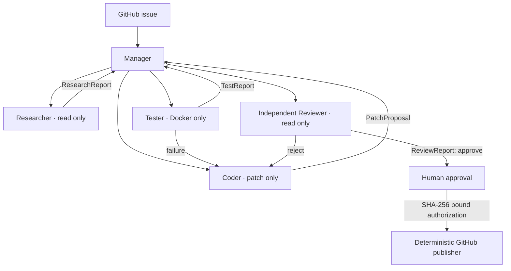

# BugPilot

BugPilot is a local-first, multi-agent software engineering system that turns a GitHub issue into a tested patch and, after human authorization, a draft pull request. Five agents have separate contexts, contracts, and permissions. All repository and execution operations use MCP.

## Architecture



The Manager owns an explicit state machine and can launch implementation, test, and history research concurrently when dependencies allow it. Specialized agents never share hidden model history; they exchange validated JSON reports persisted as `AgentMessage` records. The Reviewer receives the issue, research report, diff, and tests in a fresh context, so the Coder cannot approve its own work.

MCP provides the tool interface; the multi-agent layer provides delegation and reasoning. Repository, Git, Runner, and GitHub MCP processes are reused across roles while the policy layer applies a role/tool matrix before every call.

## Agent boundaries

| Role       | Input                              | Output                     | Capabilities                                |
| ---------- | ---------------------------------- | -------------------------- | ------------------------------------------- |
| Manager    | issue and reports                  | plan or next-role decision | orchestration only                          |
| Researcher | issue, optional failure evidence   | `ResearchReport`           | bounded reads, search, history              |
| Coder      | issue, research, revision evidence | `PatchProposal`            | bounded reads and exact-context patching    |
| Tester     | issue and current diff             | `TestReport`               | fixed Docker test/typecheck/lint operations |
| Reviewer   | issue, research, diff, tests       | `ReviewReport`             | bounded reads and Git inspection            |

The model never constructs shell commands. Runner operations map validated enums to fixed commands. The model never receives the Docker socket, Gemini key, GitHub credentials, or paths outside the task workspace.

## Stack

- Next.js 15, React 19, TypeScript
- Fastify API and Server-Sent Events
- PostgreSQL 17, Prisma, pg-boss
- Gemini through the `AgentModel` interface
- Official MCP TypeScript SDK with stdio servers
- Docker Desktop sandbox
- GitHub App or fine-grained token for publishing

## Run locally

Docker Desktop is required and the repository includes a local-only PostgreSQL binding.

```powershell
Copy-Item .env.example .env
# Add GEMINI_API_KEY to .env
npm install
npm run db:generate
docker compose up -d postgres
docker build -t bugpilot-runner:latest -f docker/runner.Dockerfile .
npm run db:push
npm run dev
```

Open `http://127.0.0.1:3000`, then select **Try the built-in demo fixture**. The flow stops at human approval. Add either a fine-grained `GITHUB_TOKEN` or GitHub App credentials only when testing draft-PR publishing.

## Safety and recovery

- PostgreSQL and Fastify bind to `127.0.0.1` by default.
- Each repository gets a resolved task-specific workspace.
- Protected paths, traversal, ambiguous patches, and role violations are rejected deterministically.
- Tests run as UID 10001 with no capabilities, no-new-privileges, two CPUs, 2 GB memory, 256 processes, a five-minute timeout, and no network.
- Test and revision counts are bounded. Exhausted tasks enter `NEEDS_ATTENTION`.
- Agent runs, messages, reports, tool calls, states, and evidence are persisted. The worker requeues interrupted nonterminal tasks on restart.
- Failed runs expose **Resume from checkpoint**. BugPilot selects the latest valid persisted stage instead of repeating completed model work or tests. An approved publish retry revalidates the exact approval hash before it creates a branch or draft PR.
- Human approval hashes the repository, target branch, base commit, complete diff, and test evidence. A changed artifact invalidates authorization.

## Verification

```powershell
npm run typecheck
npm test
npm run build -w @bugpilot/web
```

Tasks carry an `executionMode` field so the same persistence and metrics schema can compare `MULTI_AGENT` with a future `SINGLE_AGENT` baseline. The baseline runner is intentionally not enabled yet; this avoids disguising the multi-agent path as a baseline. The evaluation endpoint at `GET /metrics` reports resolution, regression, first-attempt success, delegation, role success, revision, safety, tool-call, and context-size metrics from persisted runs.

See [architecture.md](docs/architecture.md) for state transitions and interview-ready design decisions.
