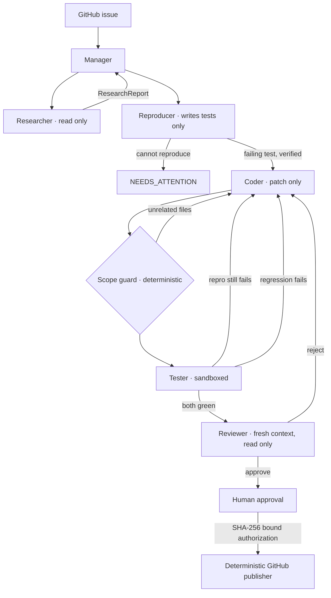

# BugWright

**Six agents, separated by authority. The one that writes the patch cannot run
it, review it, or ship it.**

BugWright turns a GitHub issue into a tested patch and, after human
authorization, a draft pull request. The interesting part is not that a model
can fix a bug — it is the boundaries around it: no patch is accepted until a
test that **failed before it** passes after it, no agent can execute code it
wrote, and a human approves a cryptographic fingerprint rather than a summary.

## Demo [Click on the Image to watch it on YouTube]

[](https://www.youtube.com/watch?v=lwb5g1JTKYM)

A full run: the issue comes in, the Researcher diagnoses it, the Reproducer
writes a test that fails, the Coder patches, the Tester proves the test now
passes, and an independent Reviewer signs off before a human authorizes the
pull request. Click to play on YouTube.



## The idea

Most "AI fixes your bug" systems are one model in a loop with different
prompts. The failure mode is not that the model is bad at coding — it is that
the same context investigates, changes, verifies, and approves its own work,
and it is a poor judge of all four.

BugWright splits on **authority**, and enforces the split in code:

| Role       | Input                        | Output                 | Capabilities                            |
| ---------- | ---------------------------- | ---------------------- | --------------------------------------- |
| Manager    | issue and reports            | plan, next-role advice | orchestration only, **no tools at all** |
| Researcher | issue, failure evidence      | `ResearchReport`       | bounded reads, search, history          |
| Reproducer | issue, research              | `ReproductionReport`   | reads, **writes test files only**       |
| Coder      | issue, research, attempt log | `PatchProposal`        | reads, exact-context patching           |
| Tester     | issue, current diff          | `TestReport`           | fixed container operations only         |
| Reviewer   | issue, research, diff, tests | `ReviewReport`         | bounded reads, git inspection           |

Each role connects to its **own** MCP server processes, started with a gate
naming exactly the tools it may call. The Tester's repository server has no
`read_file` to call; the Coder has no runner at all. An unauthorized call fails
because the capability is absent, not because a guard refused it.

The model never constructs a shell command. Language adapters build every
`argv`; the model supplies an enumerated operation and a project path that
detection already returned.

## Why the reproduction step exists

This is the part worth reading if you read nothing else.

A bug exists _because_ no test catches it. So on a real repository the existing
suite passes before a patch and passes after it — a green test run means only
**"nothing else broke."** It says nothing about whether the reported bug was
fixed.

BugWright therefore writes a failing test first, and verifies that it actually
fails:

- The Reproducer proposes a test but **cannot execute anything**. The
  orchestrator runs it through the Tester's authority, so a `reproduced: true`
  claim is overwritten by the observed exit code.
- A test that **passes** before the fix means the diagnosis was wrong. The run
  stops and says so, before any code is written.
- If nothing assertable can be written, the run stops. **That is a correct
  outcome**, and `fixtures/no-repro` exists to keep it honest.

`TestReport` then answers two separate questions — _is the bug fixed?_ and
_did anything break?_ — and a patch whose reproduction test still fails is
never approved, however green the suite is.

See [ADR 6](docs/decisions/0006-reproduce-before-fixing.md).

## Supported repositories

|               |                                                                                                          |
| ------------- | -------------------------------------------------------------------------------------------------------- |
| **Languages** | Node.js / TypeScript, Python. Reading and patching are language-agnostic; verification needs an adapter. |
| **Hosting**   | Public HTTPS GitHub repositories. No SSH, GitLab, or self-hosted.                                        |
| **Tests**     | Must run offline. Test containers get no network; only dependency installation does.                     |
| **Layout**    | Monorepos supported; detection recurses with a depth cap.                                                |
| **History**   | Shallow clone, so `get_history` sees limited history.                                                    |

A repository in an unsupported language is reported as such rather than
silently failing: BugWright will read and patch it but refuses to claim it
verified anything.

Adding a language is one `LanguageAdapter` and one container image — see
[ADR 5](docs/decisions/0005-language-adapters-and-deterministic-replay.md).

## Models

Any of Gemini, Anthropic, or OpenAI, configured per role:

```bash
BUGWRIGHT_MODEL=gemini                                   # default for every role
BUGWRIGHT_MODEL_RESEARCHER=gemini:gemini-3.5-flash-lite  # cheap, three run in parallel
BUGWRIGHT_MODEL_CODER=gemini:gemini-3.5-pro
BUGWRIGHT_MODEL_REVIEWER=anthropic:claude-sonnet-4-20250514
```

That last line is not only about quality. Two instances of the same model share
failure modes, so a same-family reviewer is disproportionately blind to exactly
the mistakes the Coder just made. Running the Reviewer on a **different model
family** makes review independence a property of the system rather than a hope.
`GET /metrics` reports whether it is actually configured.

Providers are stateless: turns, tool dispatch, budgets, retries, and context
compaction live in one provider-independent loop, so a new vendor is about
eighty lines. See
[ADR 4](docs/decisions/0004-model-providers-behind-an-agent-loop.md).

## Stack

Next.js 15 · React 19 · TypeScript · Fastify with SSE · PostgreSQL 17 · Prisma
· pg-boss · the official MCP TypeScript SDK over stdio · Docker · GitHub App or
fine-grained token for publishing.

## Run it

Docker is required. PostgreSQL and the API bind to `127.0.0.1`.

```bash
cp .env.example .env          # add one model API key
npm install
npm run db:generate
docker compose up -d postgres
docker build -t bugwright-runner-node:latest   -f docker/runner.node.Dockerfile   .
docker build -t bugwright-runner-python:latest -f docker/runner.python.Dockerfile .
npm run db:push
npm run dev
```

Open `http://127.0.0.1:3000` and choose **Try the built-in demo fixture**. The
run stops at the human approval gate. Add a GitHub token only when you want to
test draft-PR publishing.

<details>
<summary>PowerShell</summary>

```powershell
Copy-Item .env.example .env
npm install; npm run db:generate
docker compose up -d postgres
docker build -t bugwright-runner-node:latest -f docker/runner.node.Dockerfile .
docker build -t bugwright-runner-python:latest -f docker/runner.python.Dockerfile .
npm run db:push; npm run dev
```

</details>

## Verify

```bash
npm run format:check
npm run lint
npm run typecheck
npm test                      # no API key needed
npm run build -w @bugwright/web
```

The suite runs offline. `FakeProvider` scripts model turns for unit tests, and
`ReplayProvider` replays a recorded cassette so the orchestrator itself can be
exercised in CI with no key and no network:

```bash
BUGWRIGHT_RECORD=1 npm run demo    # capture once
BUGWRIGHT_REPLAY=1 npm test        # replay forever, free
```

## Safety

- **Authority is structural.** Per-role MCP servers register only that role's
  tools. No role has any GitHub tool; publishing is ordinary backend code
  behind the human gate.
- **Credentials are scoped per server.** The repository and runner servers
  receive `BUGWRIGHT_REPO_ROOT` and nothing else — not the model key, not the
  GitHub token, not `DATABASE_URL`.
- **The state machine overrides the model.** A reviewer rejection can never
  become an approval, from any state, for any model suggestion. Tested
  exhaustively over every decision a compromised Manager could return.
- **Tests are sandboxed.** UID 10001, `--cap-drop ALL`, no new privileges, no
  network, 2 CPUs, 2 GB, 256 PIDs, five-minute timeout, and the workspace
  mounted **read-only** with a tmpfs overlay — so a hostile test suite cannot
  rewrite the source under review or the `.git` directory.
- **Protected paths cover the supply chain.** `.github/workflows/`, CI configs,
  Dockerfiles, and lockfiles are unwritable; `package.json` stays editable but
  `scripts`, `bin`, and `gypfile` are not, because those execute on whoever
  merges the pull request.
- **A deterministic scope guard** compares changed files against the researched
  surface before a test run is spent. It is ordinary code, so the agent whose
  patch it checks cannot argue with it.
- **Approval binds an artifact.** The hash covers repository, branch, base
  commit, complete diff, and every test run's output. One changed byte
  invalidates it, and a publish retry revalidates before touching GitHub.
- **Publishing is idempotent.** One tree, one commit, one ref update through
  the Git Data API; an existing branch and open PR are reused, so a retried job
  cannot half-write a branch or open a duplicate.

Prompt injection is treated as something that _will_ sometimes succeed, so the
controls above do not depend on the model refusing it — see
[docs/threat-model.md](docs/threat-model.md), and `fixtures/injection-issue`
for an end-to-end attempt with its expected outcome recorded in the fixture.

## Recovery

Every run, message, report, tool call, state change, and piece of evidence is
persisted. The worker requeues interrupted non-terminal tasks on restart, and a
stopped task offers **Resume from checkpoint**: BugWright picks the latest
_valid_ persisted stage rather than repeating completed model work and test
runs. A stage only counts as complete if its whole artifact set is present — a
patch with no diff is not a finished coding stage, and a green suite whose
reproduction test still failed is not a verified test stage.

## Evaluation

`GET /metrics` computes everything from persisted runs. The number to read
first is **`soundness.verifiedFixRate`**: the share of completed tasks where a
test that failed before the patch passed after it. Anything below 1 means some
completions rest only on "nothing else broke".

`efficiency` reports real input and output tokens, cost per resolved issue, and
peak context per role measured across the whole conversation including tool
results — not the size of the opening payload.

Tasks carry an `executionMode` so the same schema can compare `MULTI_AGENT`
against a `SINGLE_AGENT` baseline. **That baseline is not implemented yet, so
no performance claim is made here.** Presenting the multi-agent path as if it
had been measured against one would be the easiest way to make this project
dishonest. The protocol for running that comparison is in
[evaluations/README.md](evaluations/README.md).

## Documentation

- [docs/architecture.md](docs/architecture.md) — states, transitions, and how
  the pieces fit
- [docs/threat-model.md](docs/threat-model.md) — adversaries, controls, and the
  gaps that are still open
- [docs/decisions/](docs/decisions/) — ADRs, including why five roles became
  six and why the state machine overrides the model
- [evaluations/README.md](evaluations/README.md) — the measurement protocol
- [fixtures/README.md](fixtures/README.md) — the corpus, including the two
  fixtures where the correct behaviour is to **refuse**
