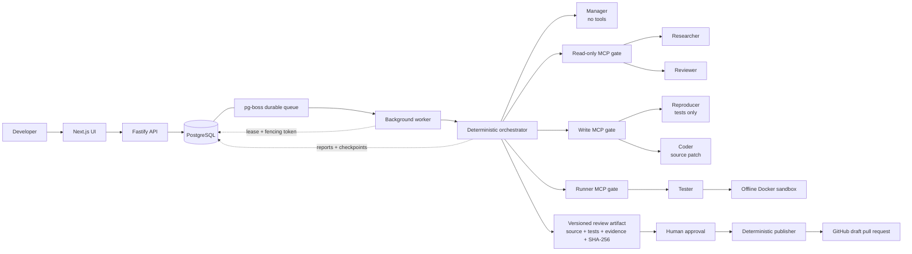

# BugWright architecture overview

This is the presentation-level view of BugWright. For implementation details,
state transitions and failure semantics, see [architecture.md](architecture.md).



## What the boundaries mean

- **The Manager has no tools.** It chooses the next step but cannot inspect,
  modify or execute repository code.
- **Reading, writing and execution are separate authorities.** The Coder cannot
  run its patch; the Tester cannot edit it; the Reviewer receives fresh,
  read-only context.
- **Observed evidence overrides model claims.** The orchestrator, not an agent,
  decides whether the reproduction failed before the patch and passed after it.
- **Approval binds bytes, not prose.** The human approves a SHA-256 fingerprint
  of the repository, destination, exact artifact and test evidence.
- **Recovery is database-coordinated.** Renewable leases and monotonically
  increasing fencing generations prevent a replaced worker from writing stale
  state. Verified checkpoints rebuild the workspace after a crash.
- **Publishing is outside agent authority.** Backend code uploads only captured,
  approved bytes and reuses an existing matching branch or pull request after a
  retry.

## End-to-end control flow

```mermaid
sequenceDiagram
  participant D as Developer
  participant O as Orchestrator
  participant R as Reproducer
  participant C as Coder
  participant T as Tester
  participant V as Reviewer
  participant P as Publisher

  D->>O: GitHub issue
  O->>R: Diagnose and write a reproduction test
  R-->>O: Test proposal
  O->>T: Run reproduction before patch
  T-->>O: Must fail
  O->>C: Produce the smallest scoped patch
  C-->>O: Patch proposal
  O->>T: Run reproduction and regression suite
  T-->>O: Reproduction passes; suite remains green
  O->>V: Fresh read-only review
  V-->>O: Approve or request revision
  O-->>D: Exact artifact and SHA-256 fingerprint
  D->>P: Approve fingerprint
  P->>P: Revalidate artifact and evidence
  P-->>D: Draft pull request
```

## Failure path

If a worker stops heartbeating, its lease expires. A replacement acquires a
higher generation, restores the last verified artifact, and resumes. Every
guarded database write and GitHub operation checks current ownership; the old
generation is fenced out if it wakes later. `npm run test:reliability` proves
this with two independent Node.js processes and PostgreSQL.
